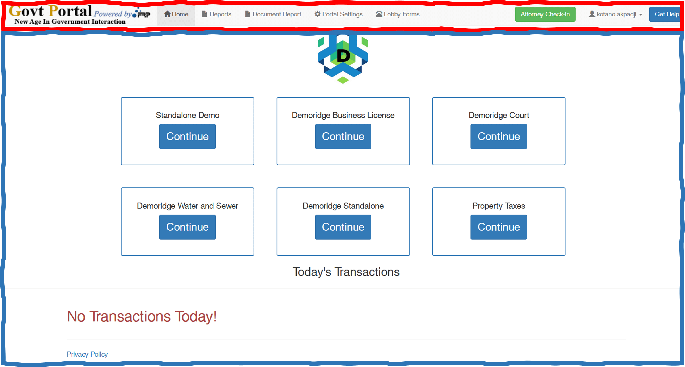

import Highlight from "@site/src/components/Highlight.js"

# The Director

## The Interface

An earlier reference to the director was made in [component](../architecture/components#clerk-interface)


<Highlight bg="#f00" color="#fff"> Navbar</Highlight> : defined by ` header.php`. <br/><br/>

<Highlight bg="#2E75B6" color="#fff"> Content</Highlight>: contained in `Clean_onlinehome.php`.<br/><br/>

It is important to note that the admin navbar appears with additional buttons.

The following piece of code explain the logi behind the navbar buttons display

```php title="Navbar.php  describes navbar buttons"
 <ul class="nav navbar-nav">
    <?php if (gp_is_logged_in()) { ?>

        <?php if ($slug == 'home-main') { ?>
            <li class="active"><a href="#"><span class="glyphicon glyphicon-home" aria-hidden="true"></span> Home <span class="sr-only">(current)</span></a></li>
        <?php } else { ?>
            <li><a href="<?php echo home_url('/home-main/'); ?>"><span class="glyphicon glyphicon-home" aria-hidden="true"></span> Home</a></li>
        <?php } ?>

        <?php if (current_user_can("reports") || current_user_can("director")) { ?>
            <?php if ($slug == 'report') { ?>
                <li class="active"><a href="#"><span class="glyphicon glyphicon-file" aria-hidden="true"></span> Reports <span class="sr-only">(current)</span></a></li>
            <?php } else { ?>
                <li><a href="<?php echo home_url('/report/') ?>"><span class="glyphicon glyphicon-file" aria-hidden="true"></span> Reports</a></li>
            <?php } ?>

            <?php if ($has_offset_portal) {
                if ($slug == 'offset-report') { ?>

                    <li class="active"><a href="#"><span class="glyphicon glyphicon-file" aria-hidden="true"></span> Offset Report <span class="sr-only">(current)</span></a></li>
                <?php } else {
                ?>
                    <li><a href="/auth-net-report"><span class="glyphicon glyphicon-file" aria-hidden="true"></span> Offset Report</a></li>
            <?php }
            } ?>

            <?php if ($slug == 'document-report') { ?>
                <li class="active"><a href="#"><span class="glyphicon glyphicon-file" aria-hidden="true"></span> Document Report <span class="sr-only">(current)</span></a></li>
            <?php } else { ?>
                <li><a href="<?php echo home_url('/document-report/'); ?>"><span class="glyphicon glyphicon-file" aria-hidden="true"></span> Document Report</a></li>
            <?php } ?>

        <?php } ?>

        <?php if (current_user_can("director")) { ?>

            <?php if ($slug == 'settings') { ?>
                <li class="active"><a href="<?php echo home_url('/settings/') ?>"><span class="glyphicon glyphicon-cog" aria-hidden="true"></span> Portal Settings <span class="sr-only">(current)</span></a></li>
            <?php } else { ?>
                <li><a href="<?php echo home_url('/settings/') ?>"><span class="glyphicon glyphicon-cog" aria-hidden="true"></span> Portal Settings</a></li>
            <?php } ?>

        <?php } ?>

        <?php if (gp_can_lobby()) { ?>

            <?php if (gp_has_lobby()) { ?>
                <li><a href="<?php echo home_url('/lobby-home/'); ?>"><span class="glyphicon glyphicon-phone-alt" aria-hidden="true"></span> Lobby</a></li>
            <?php } else { ?>
                <li><a href="<?php echo home_url('/lobby-forms/'); ?>"><span class="glyphicon glyphicon-phone-alt" aria-hidden="true"></span> Lobby Forms</a></li>
            <?php } ?>

        <?php } ?>

    <?php } elseif (!$is_kiosk) { ?>
        <?php if (!is_front_page()) { ?>
            <li>
                <a href="<?php echo home_url(); ?>"><span class="glyphicon glyphicon-home" aria-hidden="true"></span> Home</a>
            </li>
        <?php } ?>
    <?php } else { ?>
        <li><a href="<?php echo home_url('/kiosk-home/'); ?>"><span class="glyphicon glyphicon-home" aria-hidden="true"></span> Start Over</a></li>
    <?php } ?>
</ul>
```
