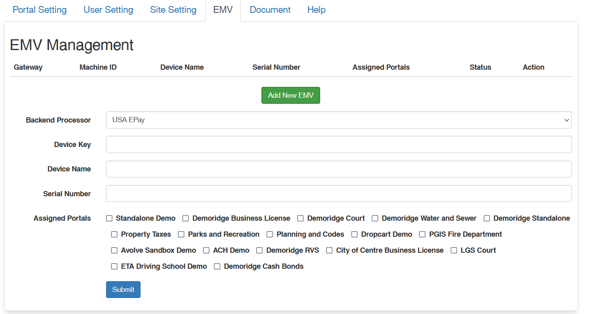

# EMV

:::tip
Important payment settings
:::

## Interface

## Adding EMD settings

To create an EMV,

<ol>

<li> Backend Processor </li>
<li>Device Key </li>
<li>Device Name</li>
<li>Serial Number </li>
<li>Assgined Portals

<ul>

<li>Standalone Demo </li>
<li>Planning and Codes  </li>
<li>etc.  </li>
</ul>
</li>

</ol>
