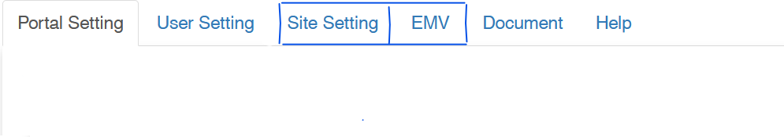

# What you should know

This section describes where and how the super_admin, director and clekr sets the parameters of the site.

:::info About the Settings Page

:::

## Interface

The `Site Setting` and `EMV` are only shown when the user is a super admin.
The files : `8.02_settings.php`

## Setting Tabs

The key parameter to note on the site setting page is **Entity**.  

<ol>
<li>

### [Portal](../settings/portal.md)

</li>
<li>

### [User setting](../settings/user.md)

</li>
<li>

### [Site Setting ](../settings/site.md)

</li>
<li>

### [EMV](../settings/emv.md)

</li>
<li>

### [Document](../settings/document.md)

</li>
<li>

### [Help](../settings/help.md)

</li>

</ol>
