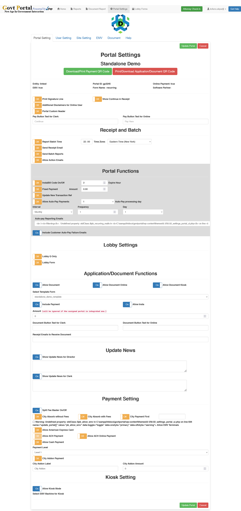

# Portal Settings

## Interface

This tab lists all the portals available on the site.  
You click on edit to edit each portal

## Settings

### General setting

The general setting displays :

<ul>

<li> The site's entity</li>
<li> The portal's ID</li>
<li> The Online payment status</li>
<li> The EMV status</li>
<li> The Attached Form name</li>
<li> The Software partner</li>
</ul>

In addition to that, you have other parameters like: Print signature line, Additional disclaimer, Portal custom header

### Receipt and Batch

Here, you set :

<ul>

<li> The Report Batch time</li>
<li> The Send Email status</li>
<li> The send Batch Reports</li>
<li> The Allow Action email : You have to provide the emails</li>
</ul>

### Portal function

<ul>

<li> InstaBill code On/Off and its expiry time</li>
<li> Fixed Payment</li>
<li> Update new transaction Ref</li>
<li> Allow Auto-Pay Payments: you must select the day and the frequency as well as the reporting email address</li>
</ul>

### Lobby Settings

<ul>

<li> Set Lobby Q only</li>
<li> Set Lobby Form</li>
</ul>

### Application/Document Functions

<ul>

<li> Set  Allow Document </li>
<li> Set  Allow Document Online</li>
<li> Allow Document Kiosk </li>
<li> Select a document template</li>
<li> Include Payment</li>
<li> Allow insta Bill</li>
<li> Set document button text and extra paramaters</li>

</ul>

### Update News

<ul>

<li> Show Update News for Director</li>
<li> Show Update News for Clerk</li>
</ul>

### Payment Setting

<ul>
<li> Split Fee Master On/Off</li>
<li> City Absorb without Fees </li>
<li> City Absorb with Fees</li>
<li> City Payment First</li>
<li> Allow EMV Terminals</li>
<li> Allow American Express Card</li>
<li> Allow ACH Payment</li>
<li> Allow ACH Online Payment</li>
<li> Allow Cash Payment</li>
<li> Payment Level</li>
<li> City Addon Payment</li>
<li> City Addon Label</li>
<li> City Addon Amount</li>
</ul>

### Kiosk setting

<ul>
<li> Allow Kiosk Mode</li>
</ul>
