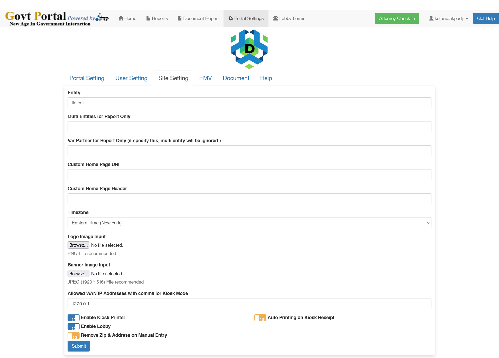

# Site Settings

This section describes where and how the director sets the parameters of the site.

:::info About the Settings Page

:::

## Interface

## Settings

The key parameter to note on the site setting page is **Entity**.  

<ol>
<li>

### Entity

The entity name is a string identifier with which a site is identified in the database. It is unique for each child site

</li>
<li>

### Logo

This referes to the logo of the site. The logo image file must only be of a `.png` type. When uploaded, the logo takes the name of the entity and it is saved ` [site root]/uplogo/[entity_name].png`

</li>
<li>

### Banner Image

This referes to the background image in the banner. The banner image file must also only be of a `.png` type. When uploaded, the image takes the name of the entity followed by banner and it is saved ` [site root]/images/[entity_name]_banner.png`

</li>

</ol>
