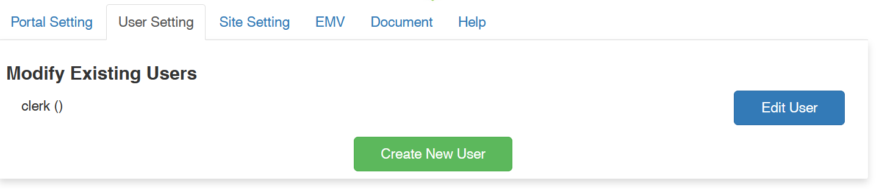
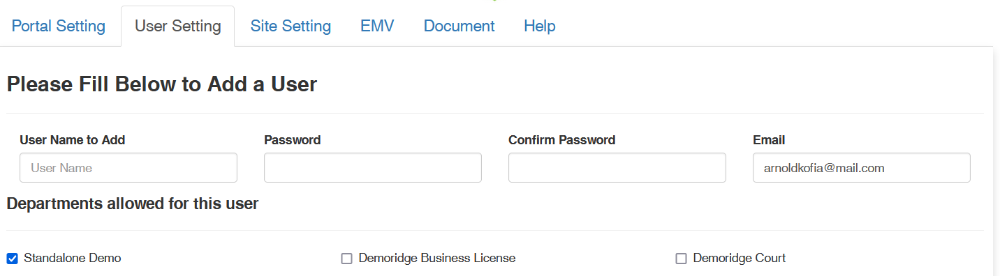
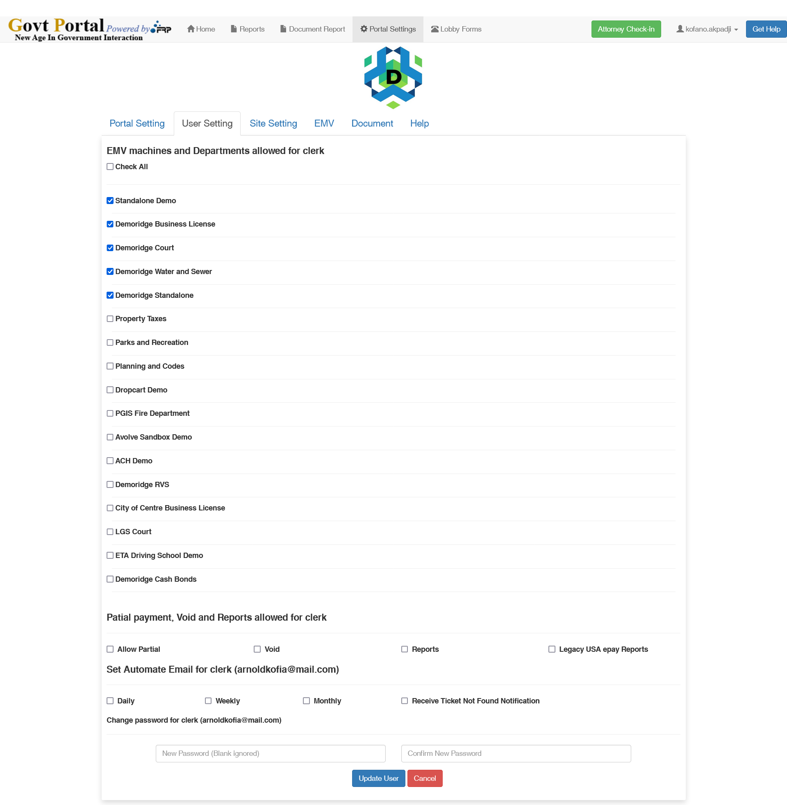

# User Settings

:::tip
Add Clerks and Directors
:::

## Interface

## Adding User

### What is going on

To create a user, the Director or Super Admin must provide

<ol>

<li>The username </li>
<li>The password and confirm it </li>
<li>The email </li>

</ol>

Then you select the portals that the User will be able to see when logged in. ( this restriction is specifically reserved for the clerks)

Directors hve full access, so you select the appropriate type of account and then you submit.

 
After adding a user, you will be invited to tweak the user settings on the age below.

