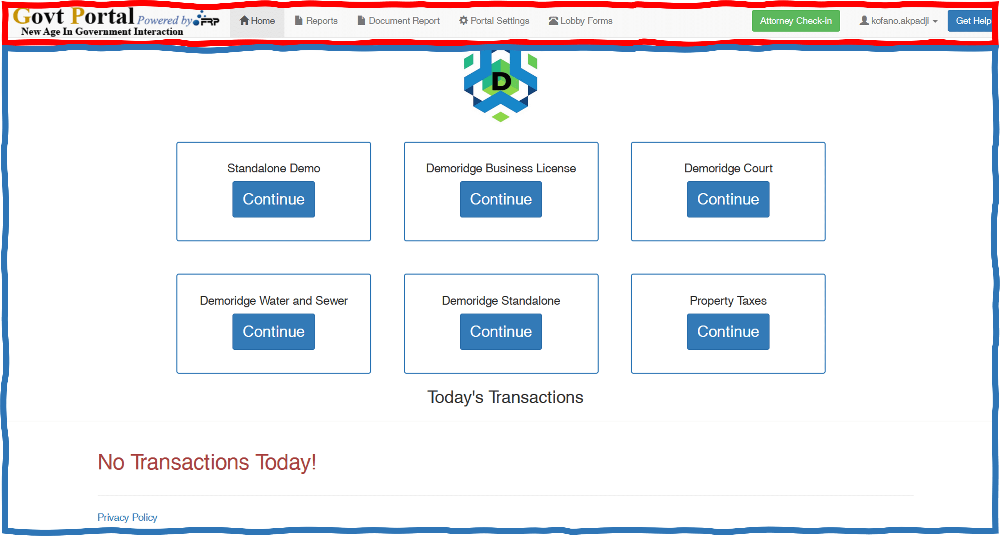

import Highlight from "@site/src/components/Highlight.js"

# UI design

## Users

<ol> 
<li> Everyone : refers to citizens who patronize the site to make payment. </li> 
<li> The clerk : [get a proper definition of who a clerk is]</li> 
<li> The director : has admin permissions on the site. He gets to set parameters of the site.</li>
</ol>

## Everyone's Interface

The default entry point of the application is `Clean_onlinehome.php`.


<Highlight bg="#f00" color="#fff"> Navbar</Highlight> : defined by ` navbar.php`. <br/><br/>

<Highlight bg="#ff0"> Banner</Highlight>: defined by `banner_header.php`. <br/><br/>

<Highlight bg="#2E75B6" color="#fff"> Content</Highlight>: contained in `Clean_onlinehome.php`.

## Logged in users

The following line of code determines the page to redirect to when the user is logged in and the site is/is not a `lobby` site

```php
if (gp_is_logged_in()) {
    if (gp_is_lobby_site()) {
        wp_redirect(home_url('/lobby-home'));
    } else {
        wp_redirect(home_url('/home-main'));
    }
    exit;
}
```

### Clerk Interface

The entry point of the application for Clerks is `Clean_Buttons_Home.php` if the site does not have a lobby
and `8.02_lobby_home.php` if the site has a lobby.


<Highlight bg="#f00" color="#fff"> Navbar</Highlight> : defined by ` header.php`. <br/><br/>

<Highlight bg="#2E75B6" color="#fff"> Content</Highlight>: contained in `Clean_Buttons_Home.php`.

### Admin Interface



<Highlight bg="#f00" color="#fff"> Navbar</Highlight> : defined by ` header.php`. <br/><br/>

<Highlight bg="#2E75B6" color="#fff"> Content</Highlight>: contained in `Clean_onlinehome.php`.<br/><br/>

It is important to note that the admin navbar appears with additional buttons.

<ul>
<li>

#### Report Page [(read more)](../admin-portal/director.md#the-interface)


</li>
<li>

#### Document Report Page [(read more)](../admin-portal/director.md#the-interface)


</li>
<li>

#### Portal Settings Page [(read more)](../admin-portal/settings/settings.md)


</li>
</ul>
