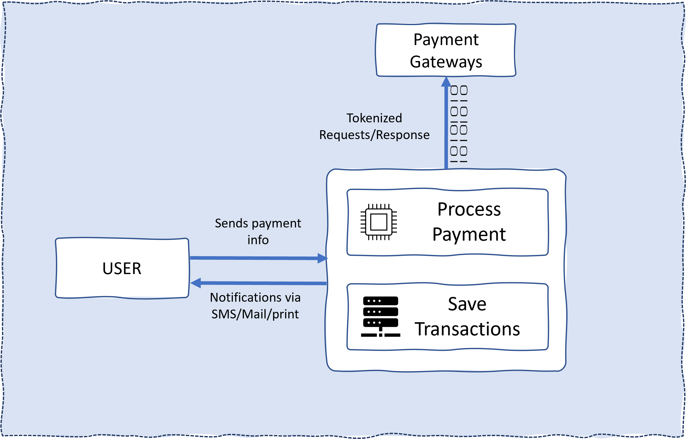

# Key Functions

:::tip
This sections seeks to expose and explain some key functions of this application, with code snippets attached
:::

## The bigger Picture

In a bigger picture, GovtPortal's function is summarized to this image below.

 <ol>

 <li>
A user accesses the platform and makes a request for payment
 </li>
 <li>
GovtPortal  receives the request, processes the payment, communicates with external payment gateways (via secured channel and tokenzed request) and saves the transactions
 </li>
 <li>
GovtPortal generates receipt back to the user
 </li>

</ol>



### Payment Processing

```
List of Files involed:

- 8.02_process_payment.php  //main file
- header.php
- gtc_portal_variables.php
- 8.03_transaction_detail.php
```

#### Include files

Include the necessary files

```php
require_once 'header.php';
require_once 'gtc_portal_variables.php';
require_once '8.03_transaction_detail.php';
```

#### Check for Portal id

Immediately abort the processing if no `portal_id` was found

```php
if (!$portal_id) {
    exit;
}
```

#### Second: [Get info from Lin here]

[[find out the details about this]]

```php
$post_token = $wpdb->get_var("SELECT post_token FROM pay_tokens WHERE post_token = '" . trim($_POST['uniq_token']) . "'");
if ($post_token) {
    echo '
    <div class="row text-center">
    <h2 class="text-danger">Refresh is not allowed here</h2>
    </div>
    ';
    if ($is_kiosk) {
        echo '<meta HTTP-EQUIV="REFRESH" content="' . $p_redirect_second . '; url=' . home_url('/kiosk-home/') . '">';
    } else if (get_current_user_id() != 0) {
        echo '<meta HTTP-EQUIV="REFRESH" content="' . $p_redirect_second . '; url=' . home_url('/home-main/') . '">';
    } else {
        echo '<meta HTTP-EQUIV="REFRESH" content="' . $p_redirect_second . '; url=' . home_url('/?is_qrcode') . '">';
    }
    exit;
}
```

#### Third: [Get info from Lin here]

We update the upcate the Credit Card information for recurring customers (if applicable), else we continure with **`processPayment()`**
Find the **`updateCC()`** function [here](#updatecc)

```php
$p_msg = NULL;
$pbo_payment_type = $_POST['pbo_payment_type'];
if ($pbo_payment_type == 'update_cc' || $pbo_payment_type == 'update_ach') {
    updateCC();
} else {
    $amount = trim($_POST['AmountOwed']);
    $amount = sprintf('%.2f', "$amount");
    if ($amount == 0) {
        exit;
    }
    processPayment();
}
```

### Saving of Transactions

#### UpdateCC

Here
