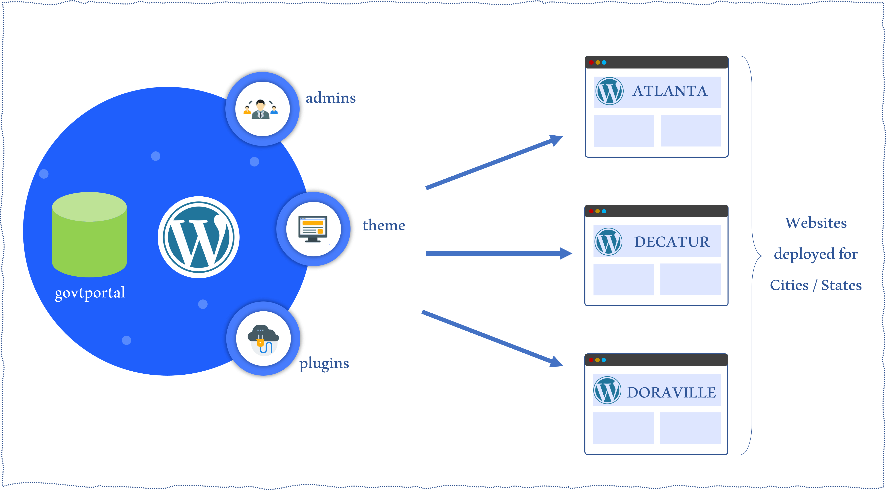

import Highlight from "@site/src/components/Highlight.js"

# High Level Architecture

GovtPortal was developed with Wordpress Multisite. That way, we can create more than one **website** on a single WordPress installation.
In our context, a **website** represents a town or state where GovtPortal LLc is providing its service.  
As shown on the image below, a child website can is deployed for Atlanta, Decatur and Doraville for instance.

:::info About the Architecture

We will provide here only the application's high level architecture

:::

## Main WordPress

### What is going on here?

GovtPortal is installed on a single WordPress installation, running a single database: **govtportal**.  
This single wordpress multisite installation is used to create and deploy private sector clients, government agencies and other partners websites. 
The children sites will share **themes, admins and plugins (if any)**.
Each child site represents a website deployed for a client.

## Child Website

A child site has a defined number of portals (based on the services the site is going to offer). The site can be accessed via **WEB** or via **KIOSK**. A clerk or a director, assigned to that site can log in. The director has the administrative power and permission to set the site's parameters.  

:::success
All the data related to a single site are identified in the database by its `entity` name
:::

### What is going on here too?

#### The database [`govtportal`](./database)

The database contains all the necessary tables (structure and data). Let's describe a few key tables seen in the previous image. 

The **`zoho_products`** table contains the definitions of all the portals on the site. The **Zoho Products** are generated on the ZOHO platform, which external to GovtPortal application. This table provides crucial bits of information, such as:

<ul> 
<li> The portal's name and ID</li>
<li> The portal's owner's and Id </li>
<li> the department </li>
<li> The Gateway and other online payment details </li>
</ul>

:::info Zoho Product details
We count 104 zoho product details in all.
:::

The **`sa_fields`** table contains the definition of form fields and types that must be displayed on a particular **sa_form**.  On the platform, users get to fill out different types of forms. This table helps customize the `sa-forms`

The **`trans_all`** table contains saved transactions.  

#### The Portals [(Find More)](../portals/intro)

The portals are displayed based on strict preset conditions. For instance, when we take a single portal, one major condition we check is if the portal is tagged as [**Quick Sale**](../portals/intro.md) and can be served with a kiosk. The other condition is if the site is accessed by QR-code or not (in this case online payment and gateway information must be present in the `zoho_products` table). 
Those 2 major conditions also have several ramifications, some of which include:

<ul>
<li> Integrated portal</li>
<li> The lobby form and/or an application document attached to the portal.</li>
</ul> 
will be detailed in the portal section.

The portal UI buttons appear differently under the different conditions.

We will detail the portal settings in the portal documentation [here](../portals/intro.md).

#### The Forms

Six (6) types of form are used:

<ul>
<li> Ticket search form</li>
<li> Kiosk ticket search form</li>
<li> SA form</li>
<li> Reserve form</li>
<li> Search record form</li>
<li> Document form</li>
</ul>

Using a ticket search form means that the portal is integrated. The platform user must then search for his/her ticket using the ticket number.  
Using the SA Form means the portal is not integrated. The platform user fills in additional details needed to process the payment. 

It is important to clarify what `INTEGRATION` means here: if GovtPortal has a dataset of ticket numbers for a specific portal, that portal is integrated.

The portal details from `zoho_products` indicated the name of the form to use.

#### Processing payment

This is where the payment processing happens. There is a query/response communication between GovtPortal and 3d party / Gateways. The gateway details are also provided by the portal details from `zoho_products`.

All transactions are saved in `trans_all` table.

#### Payment gateways

Payment Gateway REST APIs

#### Notifications and receipt

GovtPortal notifies the user of the platform via email or SMS.
