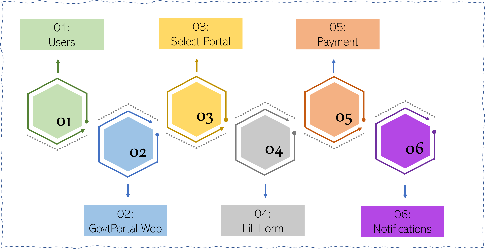

# User Journey

:::tip Platform User Journey
The journey of the platform user is different form and clerk of a director journey. the diagram below depicts the platform user (or general users) journey
:::

## In-app Journey

When users (**01**) get access to GovtPortal Platform (**02**), they are pesented with a list of portals (**03**) to select, based on the service they want to patronize. (**04**) They fill out the forms with the required information, or search for their ticket number, then they initiat the payment (**05**) process. They get notified (**06**) at the end of the transaction.  
_This cycle will repeat from level (03) if they want to perform another transaction._

