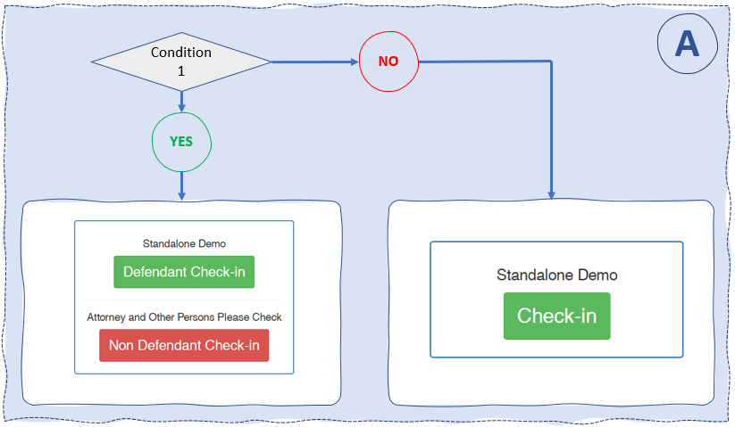
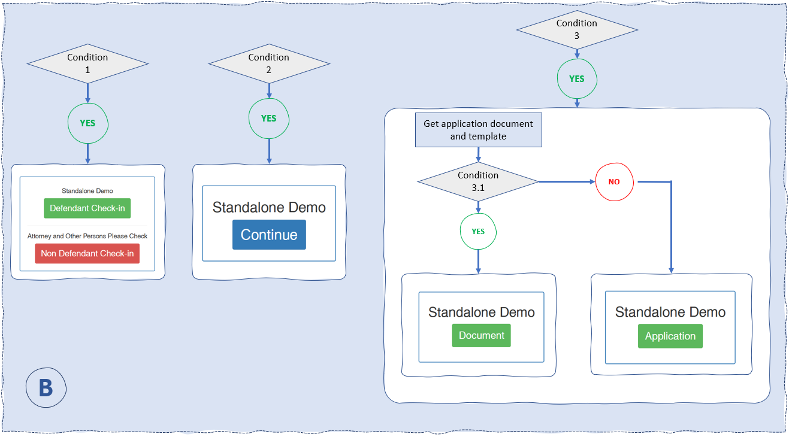

import Highlight from "@site/src/components/Highlight.js"

# What is a Portal?

A portal is component which represent a single service.
On the interface, it looks like this :


```

```

## Definitions and details

The **`zoho_products`** table in the database defines the portals. Details contained in the table are as follow: <br />
`Product_Id`: the product ID, which isdifferent from Portal ID , <br />
`Product_Owner`: the portal's owner's name, <br />
`Product_Owner_Id`: the portal's owner's ID, <br />
`portal_name`: the portal's name, <br />
`Created_Time`: , <br />
`Modified_Time`: , <br />
`Location_URL`: , <br />
`Var_Partner`: <br />

<ul>
<li>ETA </li>
<li>NewRedLine </li>
<li>Stand Alone </li>
<li>PGIS </li>
<li>evolve </li>
<li>RVS </li>
<li>LGS </li>
</ul>

`Gateway`: <br />

<ul>
<li>USA EPay </li>
<li>MX </li>

</ul>

`Source_Key`: , <br />
`Source_Pin`: , <br />
`Reporting_Source_Key`: , <br />
`Service_Fee_Source_Key`: , <br />
`Fee_Reporting_Source_Key`: , <br />
`Processor`: , <br />
`Merchant_ID`: , <br />
`Customer_Service_Number`: , <br />
`Voice_Portal`: , <br />
`Accounts_Name`: , <br />
`Portal_Id`: gp5049, gp2345 ..., <br />
`Service_Fee`: , <br />
`Credential_Notes`: , <br />
`Reporting_Email`: , <br />
`GatewayUser_Login`: , <br />
`Gateway_User_Password`: , <br />
`Entity`: , <br />
`ORI_Number_MSG_Only`: , <br />
`Version_Number`: , <br />
`Rules`: , <br />
`Portal_Status`: , <br />
`Customer_Service_Contact`: , <br />
`WP_user_Login`: , <br />
`WP_User_Password`: , <br />
`Address`: , <br />
`City`: , <br />
`State`: , <br />
`ZIP`: , <br />
`Minimum`: , <br />
`Phone_Payments`: , <br />
`Number_of_MSR`: , <br />
`Portal_Notes`: , <br />
`Fee_Model`: , <br />
`Auth_Trans_API`: , <br />
`Auth_Trans_KEY`: , <br />
`source_olp`: , <br />
`voice_source`: , <br />
`department_type`: , <br />
`Account_Number`: , <br />
`Routing_Number`: , <br />
`Bank_Name`: , <br />
`department_url`: , <br />
`GP_VOID_SOURCE`: , <br />
`OnlinePayment`: , <br />
`device_key`: , <br />
`emv_api_key`: , <br />
`fee_emv_api_key`: , <br />
`split`: , <br />
`form_name`: , <br />
`device_key2`: , <br />
`integrated`: , <br />
`mxid`: , <br />
`fee_mxid`: , <br />
`sig_cap`: , <br />
`gateway_change_date`: , <br />
`legacy_cutoff_date`: , <br />
`old_usa_source_name`: , <br />
`rules_active`: , <br />
`mx_gp_fee_user`: , <br />
`mx_gp_fee_pass`: , <br />
`timezone_portal`: , <br />
`rules_name`: , <br />
`partial_allowed`: , <br />
`disposed`: , <br />
`rules_time`: , <br />
`emv`: , <br />
`secureCVV`: , <br />
`Amex_Minimum`: , <br />
`Amex_Service_Fee`: , <br />
`Amex_Accepted`: , <br />
`AbsorbFee`: , <br />
`tpn`: , <br />
`rid`: , <br />
`auth_key`: , <br />
`kiosk_form_name`: , <br />
`token`: , <br />
`cityaddon_usa_key`: , <br />
`cityaddon_mx_id`: , <br />
`cityaddon_mx_key`: , <br />
`cityaddon_mx_secret`: , <br />
`allow_ach`: , <br />
`ach_fee_percent`: , <br />
`ach_flat_fee_amount`: , <br />
`ach_fee_merchant_secret`: , <br />
`ach_fee_merchant_key`: , <br />
`ach_fee_merchant_id`: , <br />
`ach_fee_merchant`: , <br />
`ach_fee_type`: , <br />
`ach_fee_model`: , <br />
`flatfee_usa_key`: , <br />
`flatfee_mx_id`: , <br />
`flatfee_mx_secret`: , <br />
`flatfee_mx_key`: , <br />
`link_only`: , <br />
`link_url`

## Display of Portals

### Logic Diagram

#### Main

The portals are displayed based on strict preset conditions.
The following flow diagram describes the main functional logic which guides the display of the portals.
Find the code in `Clean_onlinehome.php` file.


To start, the following code sets the **`entity`** variable and fetches the portal's details to set other needed variables

```bash title="Fetch Portal Details"
$entity = get_option('entity');
$result = $wpdb->get_results("SELECT DISTINCT * FROM  zoho_products WHERE(Entity='{$entity}')", ARRAY_A);
$form_index = 0;
$integrated_count = 0;
$is_exist_portal = false;
```

other variables are also extracted form the database query **`$result`** from the previous code

```php title="Other Variables"
    $onlinePayment = $row['OnlinePayment'];  //true or false
    $portal_name = $row['portal_name']; // string value
    $portal_id = $row['Portal_Id']; // string value: gpXXXX
    $vp = $row['Voice_Portal'];  //Voice portal Number
    $var_partner = $row['Var_Partner'];
    $dept_type = $row['department_type'];  // department
    $gateway = $row['Gateway'];  //String value : [USA EPay, MX]
    $integrated = $row['integrated']; //true or false
```

then

```php title="CONDITION 1"
//function gp_is_kiosk_portal() is defined in the function.php
function gp_is_kiosk_portal($portal_id)
{
    global $is_kiosk;
    if (!$is_kiosk) {
        return true;
    }
    global $wpdb;
    return $wpdb->get_var("SELECT pb_kiosk FROM portal_boolean WHERE pb_portal_id = '$portal_id'") === 'yes';
}

//Check the Portal name
if(substr($portal_name, -10) != 'Quick Sale' && gp_is_kiosk_portal($portal_id)){

    // The block of code that displays the portals goes here.

}
```

This previous lines check if the last **10** letters of the portal's name is not **`Quick sale`**, and if the portal is served via a kiosk.<br />
If the condition is not satisfied, the portal is not displayed. <br/>
If the condition is verified then we go ahead and set some key variables

:::tip $action variable

The **$action** variable keeps the **_slug_** or **_uri_** of the destination page when the user clicks on the portal button.

:::

```php title="Setting Variables"
$action = home_url('/sa-form/');
    if ($is_kiosk) {
        $action = home_url('/kiosk-sa-form/');
    }
    if ($integrated == 'true') {
        if ($is_kiosk) {
            $action = home_url('/kiosk-ticket-number-search/');
        } else {
            $action = home_url('/ticket-number-search/');
        }
    }
    $lobby_id = $wpdb->get_var("SELECT pb_lobby_form_id FROM portal_boolean WHERE pb_entity = '$entity' AND pb_portal_id = '$portal_id' AND pb_lobby = 'yes'");
    $lobby_only = $wpdb->get_var("SELECT pb_lobby_only FROM portal_boolean WHERE pb_entity = '$entity' AND pb_portal_id = '$portal_id'") == 'yes';
    if ($lobby_id) {
        $is_endocket = ($wpdb->get_var("SELECT lobby_type FROM lobby_forms WHERE id = $lobby_id")) == 'endocket';
        $is_alagov = ($wpdb->get_var("SELECT lobby_type FROM lobby_forms WHERE id = $lobby_id")) == 'alagov';
    } else {
        $is_endocket = false;
        $is_alagov = false;
    }

```

#### 'A' Diagram

This diagram describe how a prtal is displayed when the site has `is_qrcode` set to `true`.

<ol>
<li>

##### Condition 1 <br />

```php
<?php if ($is_endocket || $is_alagov) { ?>
    <a href="<?php echo home_url('/reserve-form/?portal_id=') . $portal_id . ($is_kiosk ? '&is_kiosk' : ''); ?>" class="btn btn-success kiosk-big-btn">Defendant Check-in</a>
    <hr>
    <h4>Attorney and Other Persons Please Check</h4>
    <a href="<?php echo home_url('/lobby-attorney/?') . ($is_endocket ? 'endocket' : 'alagov'), ($is_kiosk ? '&is_kiosk' : ''); ?>" class="btn btn-danger kiosk-big-btn">Non Defendant Check-in</a>
<?php } else { ?>
    <a href="<?php echo home_url('/reserve-form/?portal_id=') . $portal_id . ($is_kiosk ? '&is_kiosk' : ''); ?>" class="btn btn-success kiosk-big-btn">Check-in</a>
<?php } ?>
```

 </li>
</ol>



<Highlight bg="#5CB85C" color="#fff">Defendent Check-in</Highlight>:

has **`/reserve-form/?portal_id=gpXXXX`** as he href of the anchor
<Highlight bg="#D9534F" color="#fff">Non Defendent Check-in</Highlight>:

has **`/lobby-attorney/?[endocked || alagov]`** as he href of the anchor

#### 'B' Diagram

This diagram describe how a prtal is displayed when the site has `is_kiosk` set to `true`.<br />
The three conditions on the image below are independent from each other, so if any combination of the 3 condition is verified, their clause will reflect on how the buttons are shown.


<Highlight bg="#5CB85C" color="#fff">Defendent Check-in</Highlight>:

has **`/reserve-form/?portal_id=gpXXXX`** as he href of the anchor
<Highlight bg="#D9534F" color="#fff">Non Defendent Check-in</Highlight>:

has **`/lobby-attorney/?[endocked || alagov]`** as he href of the anchor
<Highlight bg="#5CB85C" color="#fff">Document</Highlight>:

has **`/reserve-form/?portal_id=gpXXXX`** as he href of the anchor
<Highlight bg="#5CB85C" color="#fff">Application</Highlight>:

has **`/reserve-form/?portal_id=gpXXXX`** as he href of the anchor

<ol>
<li>

##### Condition 1 <br />

```php title="Similar to the Condition 1 in A diagram, but wrapped in another condition"
 if ($lobby_id) {
    if ($is_endocket || $is_alagov) {
    //
    } else {
    //
    }
 }
```

 </li>
 <li>

##### Condition 2 <br />

```php title="If $gateway is set to true"
if ($gateway) {
    <form method="post" id="portal_form_<?php echo $form_index++; ?>" action="<?php echo $action; ?>">
        <input type="hidden" name="portal_id" value="<?php echo $portal_id; ?>">
        <input value="<?php echo getOption('payment_clerk_button_' . $portal_id, 'Continue'); ?>" class="btn btn-primary kiosk-big-btn" type="submit">
    </form>
}
```

 </li>
 <li>

##### Condition 3 <br />

```php title="If the portal has an application document apptached"
if (getOption('application_document_' . $portal_id, false)) {
    $form_id = getOption('application_document_form_' . $portal_id, '');
    $form = $wpdb->get_row($wpdb->prepare("SELECT * FROM gp_templates WHERE id = %d", $form_id), ARRAY_A);
    if ($form) {
        if ($form['form_type'] == 'Document') {
            echo '<div class="form-group"><a href="' . home_url('/search-record/?is_kiosk&portal_id=' . $portal_id) . '" class="btn btn-success" style="padding: 10px 15px;font-size: 24px;">', getOption('application_document_clerk_button_' . $portal_id, 'Document'), '</a></div>';
        } else {
            echo '<div class="form-group"><a href="' . home_url('/document-form/?is_kiosk&portal_id=' . $portal_id) . '" class="btn btn-success" style="padding: 10px 15px;font-size: 24px;">', getOption('application_document_clerk_button_' . $portal_id, 'Application'), '</a></div>';
        }
    }
}
```

 </li>
 <li>

###### Condition 3.1 <br />

```php title="If the portal has an application document apptached"

        if ($form['form_type'] == 'Document') {
            echo '<div class="form-group"><a href="' . home_url('/search-record/?is_kiosk&portal_id=' . $portal_id) . '" class="btn btn-success" style="padding: 10px 15px;font-size: 24px;">', getOption('application_document_clerk_button_' . $portal_id, 'Document'), '</a></div>';
        } else {
            echo '<div class="form-group"><a href="' . home_url('/document-form/?is_kiosk&portal_id=' . $portal_id) . '" class="btn btn-success" style="padding: 10px 15px;font-size: 24px;">', getOption('application_document_clerk_button_' . $portal_id, 'Application'), '</a></div>';
        }
```

 </li>
</ol>

#### 'C' Diagram

### Code Snippets
