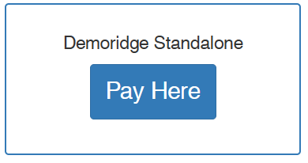

import Hightlight from "../architecture/js/Highlight.js"

# What is a Portal?

A portal is a single component of GovtPortal representing a single service.
On the interface, it looks like this :



```

```

## Definitions and details

The **`zoho_products`** table in the database defines the portals. Details contained in the table are as follow: <br />
`Product_Id`: the product ID, which isdifferent from Portal ID , <br />
`Product_Owner`: the portal's owner's name, <br />
`Product_Owner_Id`: the portal's owner's ID, <br />
`portal_name`: the portal's name, <br />
`Created_Time`: , <br />
`Modified_Time`: , <br />
`Location_URL`: , <br />
`Var_Partner`: <br />

<ul>
<li>ETA </li>
<li>NewRedLine </li>
<li>Stand Alone </li>
<li>PGIS </li>
<li>evolve </li>
<li>RVS </li>
<li>LGS </li>
</ul>

`Gateway`: <br />

<ul>
<li>USA EPay </li>
<li>MX </li>

</ul>

`Source_Key`: , <br />
`Source_Pin`: , <br />
`Reporting_Source_Key`: , <br />
`Service_Fee_Source_Key`: , <br />
`Fee_Reporting_Source_Key`: , <br />
`Processor`: , <br />
`Merchant_ID`: , <br />
`Customer_Service_Number`: , <br />
`Voice_Portal`: , <br />
`Accounts_Name`: , <br />
`Portal_Id`: gp5049, gp2345 ..., <br />
`Service_Fee`: , <br />
`Credential_Notes`: , <br />
`Reporting_Email`: , <br />
`GatewayUser_Login`: , <br />
`Gateway_User_Password`: , <br />
`Entity`: , <br />
`ORI_Number_MSG_Only`: , <br />
`Version_Number`: , <br />
`Rules`: , <br />
`Portal_Status`: , <br />
`Customer_Service_Contact`: , <br />
`WP_user_Login`: , <br />
`WP_User_Password`: , <br />
`Address`: , <br />
`City`: , <br />
`State`: , <br />
`ZIP`: , <br />
`Minimum`: , <br />
`Phone_Payments`: , <br />
`Number_of_MSR`: , <br />
`Portal_Notes`: , <br />
`Fee_Model`: , <br />
`Auth_Trans_API`: , <br />
`Auth_Trans_KEY`: , <br />
`source_olp`: , <br />
`voice_source`: , <br />
`department_type`: , <br />
`Account_Number`: , <br />
`Routing_Number`: , <br />
`Bank_Name`: , <br />
`department_url`: , <br />
`GP_VOID_SOURCE`: , <br />
`OnlinePayment`: , <br />
`device_key`: , <br />
`emv_api_key`: , <br />
`fee_emv_api_key`: , <br />
`split`: , <br />
`form_name`: , <br />
`device_key2`: , <br />
`integrated`: , <br />
`mxid`: , <br />
`fee_mxid`: , <br />
`sig_cap`: , <br />
`gateway_change_date`: , <br />
`legacy_cutoff_date`: , <br />
`old_usa_source_name`: , <br />
`rules_active`: , <br />
`mx_gp_fee_user`: , <br />
`mx_gp_fee_pass`: , <br />
`timezone_portal`: , <br />
`rules_name`: , <br />
`partial_allowed`: , <br />
`disposed`: , <br />
`rules_time`: , <br />
`emv`: , <br />
`secureCVV`: , <br />
`Amex_Minimum`: , <br />
`Amex_Service_Fee`: , <br />
`Amex_Accepted`: , <br />
`AbsorbFee`: , <br />
`tpn`: , <br />
`rid`: , <br />
`auth_key`: , <br />
`kiosk_form_name`: , <br />
`token`: , <br />
`cityaddon_usa_key`: , <br />
`cityaddon_mx_id`: , <br />
`cityaddon_mx_key`: , <br />
`cityaddon_mx_secret`: , <br />
`allow_ach`: , <br />
`ach_fee_percent`: , <br />
`ach_flat_fee_amount`: , <br />
`ach_fee_merchant_secret`: , <br />
`ach_fee_merchant_key`: , <br />
`ach_fee_merchant_id`: , <br />
`ach_fee_merchant`: , <br />
`ach_fee_type`: , <br />
`ach_fee_model`: , <br />
`flatfee_usa_key`: , <br />
`flatfee_mx_id`: , <br />
`flatfee_mx_secret`: , <br />
`flatfee_mx_key`: , <br />
`link_only`: , <br />
`link_url`

## Display of Portals

### Logic Diagram

### Code Snippets
