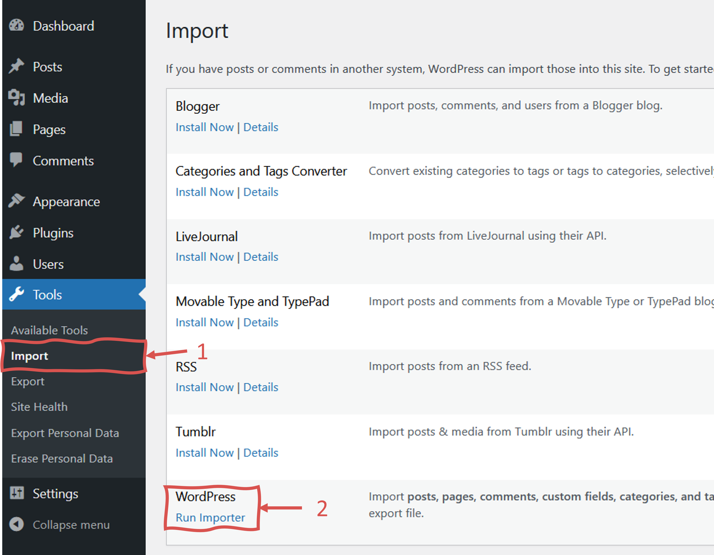
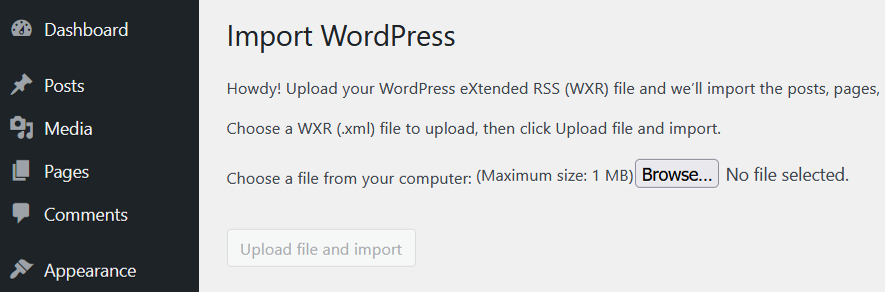
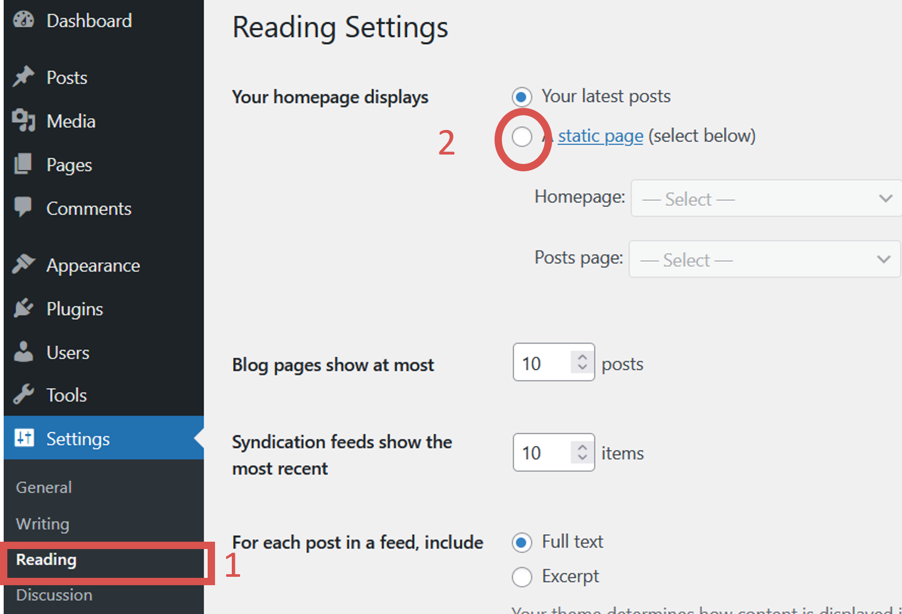
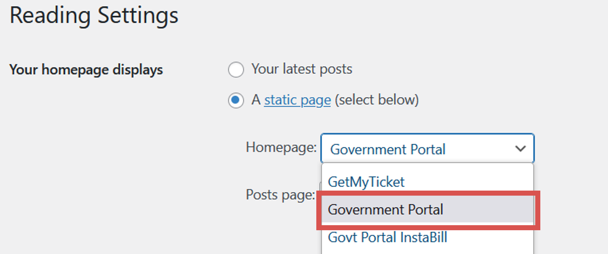

# Configuration

### Extra

1. Replace the file <code> env.php</code> with the following [`env.php`](/files/env.php).
   Do not copy and paste the following content. Use the the content of the downloaded file (env.php)

   ```< ?php
   define('GP_API_PAYMENT_URL', 'http://192.168.x.x/gateway/payment.php');
   define('GP_API_SERVICE_URL', 'http://192.168.x.x/gateway/service.php');
   define('GP_API_DOCUMENT_URL', 'http://192.168.x.x/gateway/document.php');
   define('GP_DOCUMENTS_URL', 'http://192.168.x.x/documents');
   define('GP_ESIGN_URL', 'http://192.168.x.x/esign');
   define('GP_MINOR_VERSION', '8.10');
   define('GP_MAIL_HOST', '127.0.0.1');
   define('GP_MAIL_SMTPAUTH', false);
   define('GP_MAIL_USERNAME', 'transaction@govtportal.com');
   define('GP_MAIL_PASSWORD', '');
   define('GP_MAIL_SMTPSECURE', '');
   define('GP_MAIL_PORT', 2025);
   ```

2. Create a file named `style.css` within your wordpress foder structure:

   ```
   [Drive:]\xampp\htdocs\govtportal\wp-content\themes\8.2\style.css
   ```

### Wordpress Config

#### Download Site Import file

[Download](../../static/files/demoridge.WordPress.2022-05-11.xml)

This file contains information about your site's posts, pages, comments, categories, and other content.

#### Activate & Run Importer



#### Upload File

Upload this file using the form provided on this page.



#### Set Reading Parameter



#### Set Home Page

Select `Government Portal`


### You should be good right now

One last thing

Let's insert one portal

[Download](../../static//files/onePortal.sql) the SQL file or copy and paste in your database client

````sql
SET NAMES utf8mb4;
INSERT INTO `zoho_products`
(`Product_Id`, `Product_Owner`, `Product_Owner_Id`, `portal_name`, `Created_Time`, `Modified_Time`, `Location_URL`, `Var_Partner`, `Gateway`, `Source_Key`, `Source_Pin`, `Reporting_Source_Key`, `Service_Fee_Source_Key`, `Fee_Reporting_Source_Key`, `Processor`, `Merchant_ID`, `Customer_Service_Number`, `Voice_Portal`, `Accounts_Name`, `Portal_Id`, `Service_Fee`, `Credential_Notes`, `Reporting_Email`, `GatewayUser_Login`, `Gateway_User_Password`, `Entity`, `ORI_Number_MSG_Only`, `Version_Number`, `Rules`, `Portal_Status`, `Customer_Service_Contact`, `WP_user_Login`, `WP_User_Password`, `Address`, `City`, `State`, `ZIP`, `Minimum`, `Phone_Payments`, `Number_of_MSR`, `Portal_Notes`, `Fee_Model`, `Auth_Trans_API`, `Auth_Trans_KEY`, `source_olp`, `voice_source`, `department_type`, `Account_Number`, `Routing_Number`, `Bank_Name`, `department_url`, `GP_VOID_SOURCE`, `OnlinePayment`, `device_key`, `emv_api_key`, `fee_emv_api_key`, `split`, `form_name`, `device_key2`, `integrated`, `mxid`, `fee_mxid`, `sig_cap`, `gateway_change_date`, `legacy_cutoff_date`, `old_usa_source_name`, `rules_active`, `mx_gp_fee_user`, `mx_gp_fee_pass`, `timezone_portal`, `rules_name`, `partial_allowed`, `disposed`, `rules_time`, `emv`, `secureCVV`, `Amex_Minimum`, `Amex_Service_Fee`, `Amex_Accepted`, `AbsorbFee`, `tpn`, `rid`, `auth_key`, `kiosk_form_name`, `cityaddon_usa_key`, `cityaddon_mx_id`, `cityaddon_mx_key`, `cityaddon_mx_secret`, `allow_ach`, `ach_fee_percent`, `ach_flat_fee_amount`, `ach_fee_merchant_secret`, `ach_fee_merchant_key`, `ach_fee_merchant_id`, `ach_fee_merchant`, `ach_fee_type`, `ach_fee_model`, `flatfee_usa_key`, `flatfee_mx_id`, `flatfee_mx_key`, `flatfee_mx_secret`, `link_only`, `link_url`, `token`)
VALUES
('3566',	'Michael Liu',	'356640000000040003',	'Standalone Demo',	'2019-10-27 21:03:21',	'2022-03-11 13:04:12',	'demoridge.govtportal.com',	'',	'USA EPay',	'3HSxtKLQj3Js6GLeWmghmabWr8YREW4N',	'8888',	'3HSxtKLQj3Js6GLeWmghmabWr8YREW4N',	'3HSxtKLQj3Js6GLeWmghmabWr8YREW4N',	'3HSxtKLQj3Js6GLeWmghmabWr8YREW4N',	'Priority',	'518089240888888',	'888-592-1110',	'',	'Town of Demo',	'gp3245',	'3.5',	'',	'test@govtportal.com',	'ieoGBvjBIXHlu22i0jKKwgeT',	'yVS4JPAawROVPppyejZ0N8wHkOM=',	'lintest',	'LIN8888',	'8.02 Sandbox',	NULL,	'Portal Finished',	'Michael Liu',	'',	'',	'430 Water Shadow Ln',	'Alpharetta',	'GA',	'30022',	'0.1',	'true',	'0',	'',	'No Service Fee',	'',	'',	'3HSxtKLQj3Js6GLeWmghmabWr8YREW4N',	NULL,	'court',	NULL,	NULL,	NULL,	NULL,	NULL,	'true',	'',	'',	'',	'',	'-recurring',	'',	'false',	'418387953',	'418387953',	'',	NULL,	'',	'',	'',	'ieoGBvjBIXHlu22i0jKKwgeT',	'yVS4JPAawROVPppyejZ0N8wHkOM=',	'America/New_York',	'',	'',	'',	'',	'true',	'',	'4.5',	'5',	'',	'',	'',	'',	'',	'',	NULL,	NULL,	NULL,	NULL,	'false',	NULL,	'2',	'8Xe0j2jOABdKNVZ2CQQiquy8cgE=',	'hsKydIEHMTcIPQHzrCrBZwQB',	'418387953',	'IPPAYWARE (356640000050421251)',	'Flat Fee',	'Split Fee',	'',	'',	'',	'',	'false',	'',	NULL);```
````
